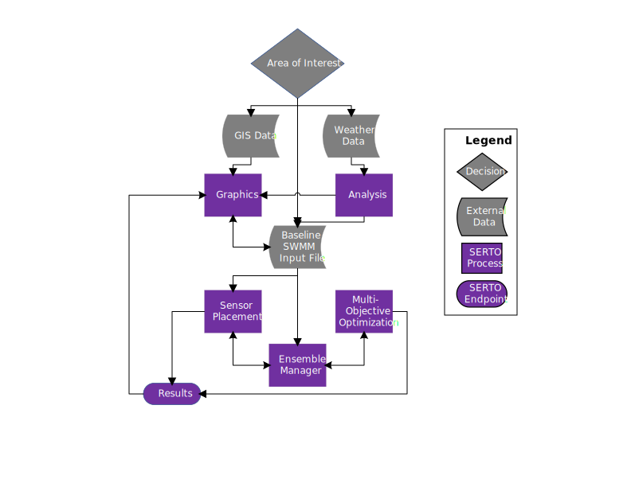

========
Overview
========
The Stormwater Emergency Response Tool and Optimizer (SERTO) is a Python package designed to facilitate the use of the United States Environmental Protection Agencies’ (EPA) `Storm Water Management Model <https://www.epa.gov/water-research/storm-water-management-model-swmm>`__ (SWMM) in solving optimization problems. The `Homeland Security Research Program <https://www.epa.gov/emergency-response-research>`__ at EPA creates tools that assist emergency planners, responders, and utilities to prepare for and recover from catastrophic contamination incidences. SERTO is intended to assist in designing stormwater monitoring networks to detect contamination and assist in siting infrastructure such as real time control sensors and stormwater control measures.

Unique aspects of an insidious wide area chemical, biological, or radiological (CBR) incident necessitate stormwater system tools to inform preparations and recovery after an attack. This includes an unpredictable starting location of the pollution, contaminants that are acutely dangerous, and boundaries that may shift due to stormwater transport. The number of samplers/sensors available for monitoring a stormwater network is also often constrained due to feasibility (i.e., economic and installation) and generating the ensemble of stormwater model runs to plan for the stochastic processes involved can be burdensome. Detecting where contamination has occurred as soon as possible can aid in strategic decisions such as where to install treatment devices and stage waste. However, many stormwater utilities saddled by day-to-day operations do not invest in this type of planning since a tool designed for these scenarios has been unavailable for stormwater systems. 

SERTO builds upon a robust history of optimization tools developed by the EPA for emergency response and stormwater control measure siting to fill this gap. It is inspired by two deprecated EPA tools: `TEVA-SPOT <https://github.com/USEPA/TEVA-SPOT-Toolkit>`__ and `SUSTAIN <https://www.epa.gov/water-research/system-urban-stormwater-treatment-and-analysis-integration-sustain>`__. TEVA-SPOT was developed from 2005-2011 by EPA and partners as a suite of sensor placement tools for drinking water distribution networks. The TEVA portion of the tool managed the ensemble of model runs and the SPOT portion of the tool the sensor placement optimization functionality. “SPOT” was later developed by Sandia National Laboratories into a network agnostic sensor placement optimization package called `Chama <https://chama.readthedocs.io/en/latest/>`__ that is included in SERTO. On the other hand, SUSTAIN was developed by EPA until 2014. Amongst its’ functionality, it allowed utilities to use transport algorithms from SWMM and two search algorithms to identify cost-effectiveness curves for stormwater best management practices.  SERTO was designed to ease the burden in optimizing the placement of resources within a stormwater collection system by coupling SWMM with existing optimization packages and providing support in generating and managing ensembles of model runs. SERTO currently contains the following functionality:

Ensemble Manager
================
SERTO includes an ensemble manager that builds a set of SWMM input files and precomputes simulation results for use by the optimization packages. The conditions varied in the SWMM input files can be set directly from a list of options (e.g., rainfall time series, pollutant starting amount, and plume conditions) or can be implemented using a custom python script to systematically change a SWMM model input file. A contaminant plume feature (specified or gaussian) has been included to vary sub catchment pollutant loadings in a manner representative of deposition from an airborne CBR incident. 

Analysis Tools
==============
SERTO includes modules to analyze wind and rain data to determine which events to include in the ensemble.  The rainfall analysis includes the capability to calculate return periods and cluster and extract representative storm events. The wind analysis determines the probabilities of wind speed and direction and samples from the distribution.

Optimizer Coupling
==================
SERTO currently couples SWMM with two optimization packages. For sensor placement, the open- source Python package `Chama <https://chama.readthedocs.io/en/latest/>`__ is used which includes mixed-integer linear programming formulations for impact and coverage of sensor placement. For multi-objective optimization, SERTO couples SWMM with the open-source Python package `Platypus <https://platypus.readthedocs.io/en/latest/index.html>`__.

Visualization
=============
SERTO contains graphics options to assist in the optimization projects. It’s possible to plot time series, overlay deposition plumes and results onto SWMM subcatchments, and create tradeoff curves. Additionally, Jupyter notebooks have been configured to assist in visualization.

Cluster and Cloud Computing Compatibility
=========================================
For small ensembles SERTO can be run on your personal linux or windows computer. For larger ensembles SERTO has the capability to be run on a cluster or cloud services vendor and collate the results.

The figure below shows a visual of SERTO's workflow:

  
