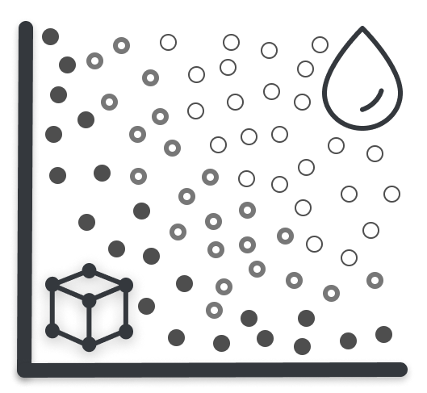

User Guide
==========

The Water Network Tool for Resilience (SERTO) is an EPANET compatible Python package 
designed to simulate and analyze resilience of water distribution networks.

.. toctree::
   :maxdepth: 1
   :hidden:
   :caption: Introduction

   overview
   installation
   framework
   units
   getting_started

.. toctree::
   :maxdepth: 1
   :hidden:
   :caption: Model building

   waternetworkmodel
   model_io
   controls
   networkxgraph
   layers
   options

.. toctree::
   :maxdepth: 1
   :hidden:
   :caption: Simulation

   hydraulics
   waterquality
   waterquality_msx
   resultsobject

.. toctree::
   :maxdepth: 1
   :hidden:
   :caption: Analysis

   disaster_models
   criticality
   resilience
   fragility
   morph
   graphics
   gis
   advancedsim

.. toctree::
    :maxdepth: 1
    :hidden:
    :caption: Backmatter

    license
    whatsnew
    developers
    acronyms
    reference

US EPA Disclaimer
-----------------

The U.S. Environmental Protection Agency through its Office of Research and Development funded and collaborated 
in the research described here under an Interagency Agreement with the Department of Energy's Sandia National Laboratories.
It has been subjected to the Agency's review and has been approved for publication. Note that approval does not signify that 
the contents necessarily reflect the views of the Agency. Mention of trade names products, or services does not convey official 
EPA approval, endorsement, or recommendation.

Citing SERTO
-----------------
To cite SERTO, use one of the following references:

* Buahin C. A. and Mikelonis A. (2024). The Stormwater Emergency Response Tool & Optimizer (SERTO) Manual:
Version 0.2.3. U.S. EPA Office of Research and Development
